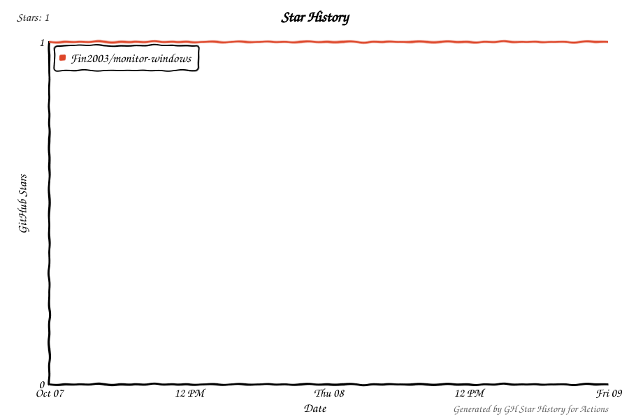

# Monitor Windows

## Windows EXE release

Download `Monitor-Windows-1.1.2-Setup-x64.exe` from this private repository's Releases and double-click it. The one-click installer creates desktop and Start menu shortcuts and starts the application. Electron and the Windows hardware engine's .NET runtime are bundled, so the destination computer does not need Node.js, npm or .NET. Windows x64 is required. The package is unsigned.

The application stores its own blank profile in `%APPDATA%/monitor-windows`; sign in and configure your own keys after installation. Hardware sensor access may request UAC when the hardware plugin starts.

To reproduce the installer from source, run `install-dependencies.bat`, then `npm run dist:win`. The output is written to `release/`.


Windows 10/11 x64 副屏监控程序，使用 Electron、Svelte 和独立硬件采集引擎。

包含 Coding Plan 额度面板（火山引擎、讯飞、OpenCode Go）、系统传感器、Tibo 雷达、时钟和缩略总览。

## 一键启动

1. 下载仓库 ZIP 并解压，或使用 Git 克隆到本地目录。
2. 双击 **`start.bat`**。首次运行会自动执行依赖安装，构建硬件引擎和界面。
3. 硬件监控引擎请求 UAC 时确认；管理界面以普通用户权限启动。
4. 在管理页添加自己的账号，登录所需渠道，再启用插件。

也可以先双击 **`install-dependencies.bat`**，完成安装后再启动。安装过程需要联网；缺少工具时通过 Windows `winget` 安装 Node.js LTS 和 .NET 8 SDK。建议使用 Node.js 24 LTS；最低版本为 22.12.0。

如果系统没有 `winget`，先安装 Microsoft Store 中的 **App Installer（应用安装程序）**，或自行安装 Node.js 和 .NET SDK 后重试。批处理会保留失败信息，便于查看原因。

## 初始配置

- 所有 Coding Plan 渠道均需自行连接；仓库没有预置账号、密码、Cookie 或登录会话。
- Tibo 雷达在设置中填写自己的 LLM 地址、模型和 API Key，或填写 JEV 的 API Key。开启回复辅助时，按界面提示连接自己的 X 账号。
- 系统监控首次使用时，选择自己的硬件及传感器；显示器和布局在管理页设置。
- 默认不注册开机自启；可通过启动任务脚本自行开启。

源码版的配置、登录态和密钥存放在本目录 **`.device-profile`**；安装版使用 **`%APPDATA%\monitor-windows`**，与其他 Monitor 安装分开。Tibo LLM/JEV Key 使用 Electron `safeStorage` 保存；浏览器渠道使用各自的持久会话分区。

不要将这个数据目录、浏览器 Cookie、配置导出或诊断报告上传到仓库。`.gitignore` 已排除相关文件，以及依赖、构建产物和机器运行缓存。

## 开发和打包

```bat
install-dependencies.bat
npm run dev
npm run pack
```

`npm run pack` 在 `release\win-unpacked` 生成 Windows 程序目录；`npm run dist` 生成 Windows 安装包。硬件引擎以自包含方式发布，运行时无需另装 .NET Runtime。

源码保留插件资源和第三方许可证；Windows 构建不依赖仓库中的个人配置或预编译引擎。默认启动不会启用实验性 PawnIO 驱动，相关功能由管理页的明确操作触发。

## 启动任务

```bat
start.bat --uninstall-task
powershell -NoProfile -ExecutionPolicy Bypass -File scripts\monitor-autostart.ps1 -Action install
powershell -NoProfile -ExecutionPolicy Bypass -File scripts\monitor-autostart.ps1 -Action uninstall
```

第一条删除可选的 GUI 启动任务；后两条安装/删除可选开机自启与崩溃恢复任务 `Monitor.Windows.AutoStart`。从托盘退出会让看门狗保持关闭，手动启动或下次开机后可以重新运行。

第三方软件信息见 [系统监控许可证说明](plugins/system-monitor/THIRD_PARTY_NOTICES.md)。

## Windows 源码启动

双击 `start.bat` 会以普通用户权限启动管理界面，硬件监控引擎按需单独提权。自启动看门狗也使用同一入口，不再调用旧的高权限 GUI 任务。

## 开源协议与致谢

本项目原始代码采用 [ISC 协议](LICENSE)。感谢 **LibreHardwareMonitor**、**lfreist/hwinfo**、**CapFrameX**、**PawnIO / PawnIO.Modules** 提供系统监控实现与参考。

第三方组件保留原有许可证；完整版权、许可证文本、版本和源码取得方式见 [THIRD_PARTY_NOTICES.md](THIRD_PARTY_NOTICES.md)。安装包带有许可证目录，Release 同时提供应用源码和第三方源码包。1.0.2 的实验性 PawnIO 驱动仅提供源码，安装包不附该实验驱动；部分新显卡的额外温度读数需要自行构建驱动。

## 独立启动与发布内容

双击 `start-clean.bat` 使用本目录的 `.review-profile`，便于检查首次启动状态；该目录首次运行时创建，不读取其他安装的配置。普通 `start.bat` 使用本目录的 `.device-profile`。两种入口都会保存你随后自行设置的内容，可在这些目录检查。安装版的配置目录保持独立。

Git 仅保存应用源码、构建脚本、依赖版本锁和必要的第三方源码及许可证。`node_modules`、工具链、构建产物、账号配置、Cookie、设备连接信息、硬件缓存和诊断报告不会提交。EXE 内的 Electron、.NET 与串口运行库是运行所需组件；安装包不附开发依赖或预置账号数据。源码 ZIP 从对应分支的 Git 文件生成。

系统监控的 `third-party/hwinfo` 是 Linux 后端构建所需的 MIT 源码；ESP32 的字体 C 文件是固件构建输入。第三方许可证、字体源码和版本锁均保留。

## Coding Plan 接口查询

Key / AKSK 认证与用量解析改编自 [CC Switch](https://github.com/farion1231/cc-switch)，支持火山 Coding / Agent Plan、OpenCode Go、Kimi、智谱国内 / 国际版、MiniMax 国内 / 国际版、ZenMux、Command Code。火山和 OpenCode 可选择已有网页登录会话；讯飞使用 [QuotaRadar](https://github.com/Asklear/QuotaRadar) 的会话接口。插件页与查询设置均标明来源，完整 MIT 许可证随安装包提供。

在账号的“接口查询”里输入自己的凭据，然后点“保存并验证”。Key 使用 Windows 系统加密，仅保存在该安装的本地配置目录，界面只回显是否已保存。火山需要账号级 AK/SK 和 Ark 用量权限；ZenMux 需要 Management API Key。认证失效、无订阅与网络 / 代理失败会显示具体原因。发布包不预置凭据、登录会话或 Workspace。

## Star 趋势

每天通过 GitHub Actions 更新；私有仓库内也可查看，无需额外配置个人 Token。

<picture>
  <source media="(prefers-color-scheme: dark)" srcset="docs/star-history/chart-dark.svg">
  
</picture>

图表由 [GH Star History for Actions](https://github.com/kernalix7/GH-Star-History-for-Actions) 生成。
